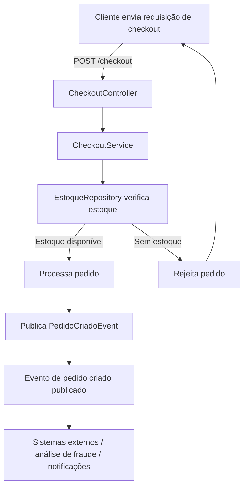

# Análise de Risco e Fraude

Projeto Spring Boot para checkout de pedido com análise de risco/fraude e publicação de evento de pedido criado.

## Visão geral

Este projeto implementa um fluxo de checkout que recebe dados de pedido e pagamento, valida o estoque e realiza a publicação de um evento após a criação do pedido.

## Arquitetura do projeto

A arquitetura do projeto segue um padrão em camadas que separa responsabilidades e facilita manutenção:

- `Controller`: expõe endpoints HTTP e recebe as requisições de checkout.
- `Service`: orquestra o fluxo de negócio, valida estoque e processa o pedido.
- `Repository`: abstrai a consulta e validação do estoque.
- `Producer`: publica eventos assíncronos após a criação do pedido.
- `Domain`: contém os modelos e enums que representam o domínio do pedido e pagamento.

Essa abordagem permite testar cada camada de forma isolada e evoluir o sistema com mais facilidade.

## Event-Driven Architecture (EDA)

O projeto adota um padrão de arquitetura orientado a eventos para desacoplar a lógica de negócio da comunicação assíncrona:

- Eventos são publicados quando um pedido é criado (`PedidoCriadoEvent`).
- Os produtores (`PedidoCriadoProducer`) enviam eventos para consumidores potenciais sem depender de sua implementação.
- Isso torna o sistema mais escalável e permite integrar serviços de forma assíncrona, como análise de fraude, filas e notificações.

## Destaques

- Estrutura preparada para evoluir com mecanismos de análise de risco e fraude.
- Uso de DTOs para desacoplamento dos dados de entrada dos modelos de domínio.
- Facilidade de extensão para integração com sistemas de pagamento, filas e serviços externos.
- Uso de técnicas de IA/ML para análise de risco e detecção de fraudes, permitindo regras adaptativas e modelos preditivos.

## Tecnologias usadas

- Java
- Spring Boot
- Maven

## Como rodar

1. Abra o terminal na pasta do projeto.
2. Execute `mvn clean install`.
3. Inicie a aplicação com `mvn spring-boot:run`.

## Endpoint principal

- `POST /checkout`

O endpoint recebe um `PedidoDTO` com as informações do pedido e do pagamento.

Exemplo de payload:

```json
{
  "pedidoId": 123,
  "clienteId": 456,
  "valorTotal": 299.90,
  "metodoPagamento": "CARTAO",
  "statusPagamento": "PENDENTE"
}
```

## Fluxo do processamento

1. O cliente envia a requisição de checkout.
2. `CheckoutController` delega ao `CheckoutService`.
3. `CheckoutService` verifica estoque com `EstoqueRepository`.
4. Se aprovado, o pedido é processado.
5. Um evento `PedidoCriadoEvent` é publicado pelo `PedidoCriadoProducer`.

## Fluxograma do fluxo de processamento



## Observações

- Ajuste as configurações em `src/main/resources/application.properties` conforme necessário.
- O projeto pode ser estendido para integrar mecanismos reais de análise de fraude, filas e sistemas de pagamento.
- pode ser integrado com Kafka
